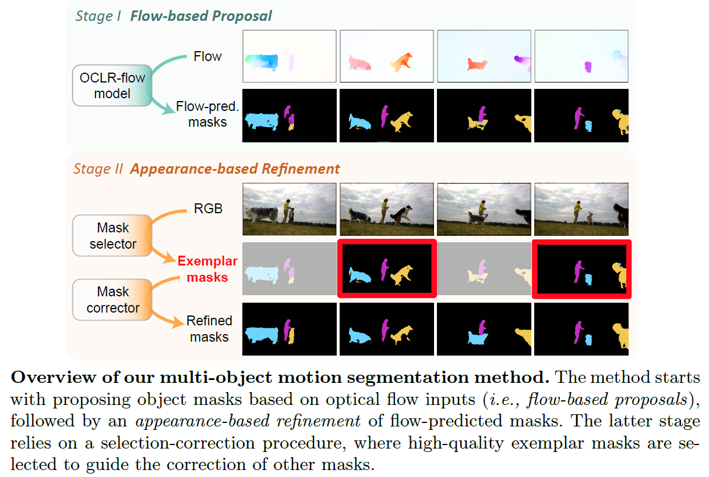

# Appearance-Based Refinement for <br> Object-Centric Motion Segmentation

Junyu Xie, Weidi Xie, Andrew Zisserman

Visual Geometry Group, Department of Engineering Science, University of Oxford

ECCV, 2024

<a src="https://img.shields.io/badge/cs.CV-22312.11463-b31b1b?logo=arxiv&logoColor=red" href="https://arxiv.org/abs/2312.11463">  
</a>
<a href="https://www.robots.ox.ac.uk/~vgg/research/appear-refine/" alt="Project page"> 
</a>

<br>
<br>
<p align="center">
  
</p>


## The YouTubeVOS2018-motion Dataset
* YouTubeVOS2018-motion (short for YTVOS18-m, where "m" is for motion) is a subset selected from *training split* of YTVOS2018. 
* These selected sequences are used for *evaluation*, with predominantly moving objects involved (*i.e.,* objects can be discovered based on their motion).
* The list of selected sequences can be found in ```resources/ytvos18m_seq.json```, and the video frames and ground truth annotations can be downloaded from [YouTubeVOS2018](https://youtube-vos.org/challenge/2018/).
  
## Pre-computed results and checkpoints
* The masks after refinements can be found [here](https://drive.google.com/drive/folders/1LXhBzLUQODPd4GXBFc0USzZHO0UiSqhH?usp=sharing).
* The *flow-predicted* masks from self-supervised adapted OCLR models are provided as the *inputs* for the refinement, which can be found [here](https://drive.google.com/drive/folders/1uktn4n4Si2jljJvZklADW4J9y1YeGmnO?usp=sharing). The corresponding checkpoint for self-supervised adapted OCLR models can be found [here](https://drive.google.com/drive/folders/1_I6B7GhXKNJ1bloQo7BaKxk8CIm8Diy3?usp=sharing).
* The checkpoints for the mask selector and self-supervised adapted mask correctors can be found [here](https://drive.google.com/drive/folders/1_I6B7GhXKNJ1bloQo7BaKxk8CIm8Diy3?usp=sharing).

## Scripts
#### Requirements
```pytorch>=2.0```,
```Pillow```,
```opencv```,
```einops```

#### Inference
```
python main.py --save_pred --dataset DAVIS17m --ckpt_selector={} --ckpt_corrector={}  \ 
                --img_dir={} --gt_dir={} --mask_dir={} --save_dir={} 
```
where ```--save_pred``` saves the refined masks
<br> &nbsp;&nbsp;&nbsp;&nbsp;&nbsp;&nbsp;&nbsp;&nbsp;&nbsp;&nbsp; 
```--ckpt_selector``` and ```--ckpt_corrector``` indicate the checkpoints for the mask selector and corrector
<br> &nbsp;&nbsp;&nbsp;&nbsp;&nbsp;&nbsp;&nbsp;&nbsp;&nbsp;&nbsp;
```--img_dir``` and ```--gt_dir``` denote the directories for dataset images and corresponding gt annotations
<br> &nbsp;&nbsp;&nbsp;&nbsp;&nbsp;&nbsp;&nbsp;&nbsp;&nbsp;&nbsp;
```--mask_dir``` denote the directory of *input* flow-predicted masks to be refined
<br> &nbsp;&nbsp;&nbsp;&nbsp;&nbsp;&nbsp;&nbsp;&nbsp;&nbsp;&nbsp;
```--save_dir``` specifies the directory to save predicted masks


## Citation
If you find our paper/repository helpful, please consider citing our works:
```
@InProceedings{xie24appearrefine,
    title     = {Appearance-Based Refinement for Object-Centric Motion Segmentation},  
    author    = {Junyu Xie and Weidi Xie and Andrew Zisserman},  
    booktitle = {ECCV},  
    year      = {2024}
}
```

```
@inproceedings{xie2022segmenting,
    title     = {Segmenting Moving Objects via an Object-Centric Layered Representation}, 
    author    = {Junyu Xie and Weidi Xie and Andrew Zisserman},
    booktitle = {NeurIPS},
    year      = {2022}
}
```


 

 
